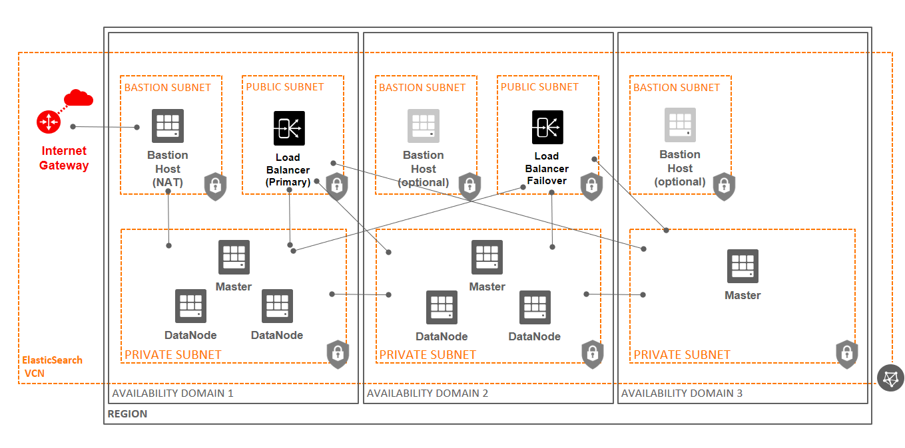
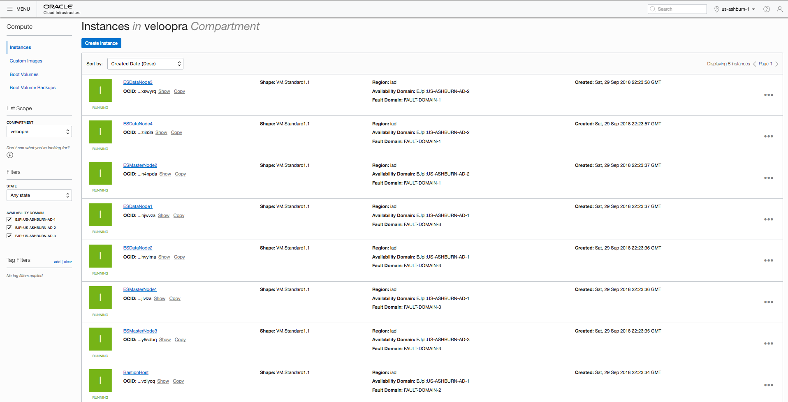
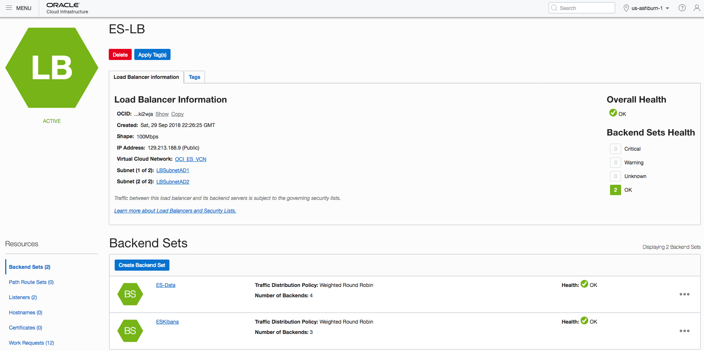
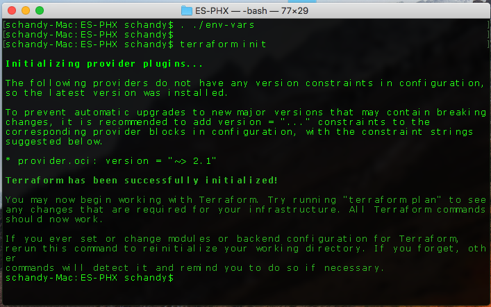
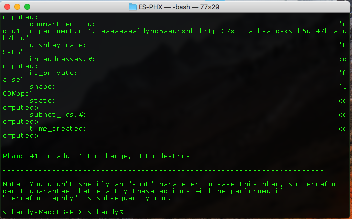
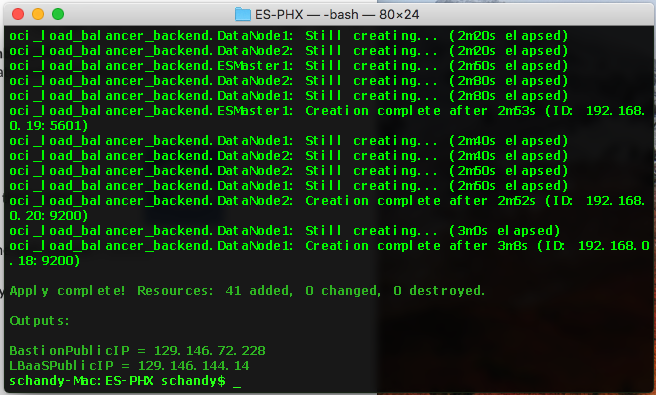
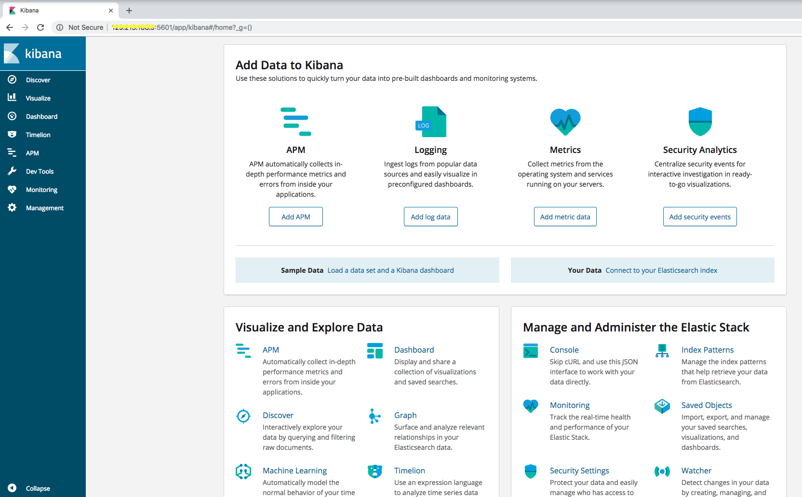
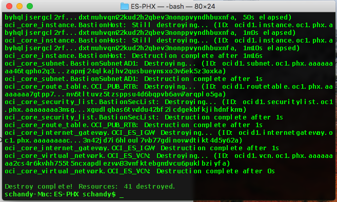

# IEU version of the OCI Elastic Search instance.

* Clone the repo and select the desired branch
* Create a local version of env-vars, completing the fields within this file
* Set up an API key with public key entered in the Cloud console, and the location and fingerprint added to the local env-vars file
* The second private/public key pair are for login to cloud instances, and should be present on your system

Once you've set this up you need to run ```. ./env-vars_local``` to put these into environment. You will need to run a ```terraform init``` in the directory if you haven't previously. Then run ```terraform plan```, and if that works run ```terraform apply```.

**When finished**: To destroy the cluster run ```terraform destroy```. Alternatively stop the instances in the cloud console if you might re-use them.

## Using the Elastic cluster

Once the cluster has booted (a few minutes after Terraform has completed):

* Use Kibana at http://\<BastionPublicIP\>:5601
* SSH into opc@\<LBaaSPublicIP\> and run curl -XGET http://\<masternode_privateIP\>:9200/_cat

<hr>

# OCI Elasticsearch Quick Start

Quick Start a Highly Available Elasticsearch Cluster on OCI. 

# Prerequisites
First off you'll need to do some pre deploy setup.  That's all detailed [here](https://github.com/cloud-partners/oci-prerequisites).

# Architecture Brief



This deploys an Elasticsearch cluster with 3 master nodes in all 3 ADs and 4 data nodes in 2 ADs. Necessary Elasticsearch [configuration](https://www.elastic.co/guide/en/elasticsearch/reference/current/allocation-awareness.html) is in place to make sure primary and replica of the same same index sharda are never stored in the same AD. Currently 200GB additional volume is added to data nodes for index, this can be modified by editing variabes.tf.

### Cluster Compute Instances on OCI Console



OCI LBaaS is used for load balancing index operations onto the data nodes and Kibana access to master nodes, by using 2 different listeners one for Kibana and other for index data access, backed by backend set with master node backends and data node backends respectively. LBaaS is launched into public subnet with public IP, this can be modified by modifying the lbaas.tf to make it private LBaaS.

### Load Balancer on OCI Console



## How to Launch the Cluster.
1. Download or clone the files to your local machine with Terraform installed 
2. Edit env-vars file and fill your OCI credentials
3. Exceute below script to set OCI crendials in your environment 

       . ./env-vars

4. Edit variables.tf and change any parameter values like VM/BM, LBaaS shape and data volume size
5. Run below terraform commands to deploy the cluster.
   
       terraform init
       
### Sample Output of terraform init:



       terraform plan

### Sample Output of terraform plan:



       terraform apply

### Sample Output of terraform apply:



Once the launch is finished use bastion public IP to access the Elasticsearch cluster nodes and use LBaaS IP address to accees 
Elasticsearch and Kibana as shown below.

       http://<LBaaS_IP>:9200/_cat     <==== Elasticsearch URL from browser or use curl intead.

### Sample output of "curl -XGET LBaaS_IP:9200" :
       
   ```
       {
         "name" : "esdatanode1",
         "cluster_name" : "oci-es-cluster",
         "cluster_uuid" : "HQoVo6LFQqmQcaViNyyQ7w",
         "version" : {
           "number" : "6.4.0",
           "build_flavor" : "default",
           "build_type" : "rpm",
           "build_hash" : "595516e",
           "build_date" : "2018-08-17T23:18:47.308994Z",
           "build_snapshot" : false,
           "lucene_version" : "7.4.0",
           "minimum_wire_compatibility_version" : "5.6.0",
           "minimum_index_compatibility_version" : "5.0.0"
         },
         "tagline" : "You Know, for Search"
       }
   ```

       http://<LBaaS IP>:5601     <==== Kibana URL from browser 
      
### Sample Kibana Web Page:



## How to Delete the Cluster. 

From the terraform directory where the files were downloaded to, run below command to delete the entire Cluster.

       terraform destroy
       
### Sample Output of terraform destroy:


